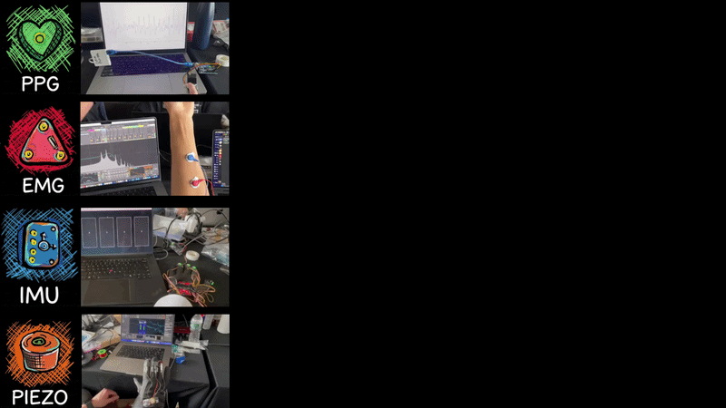

# BioBeats🫀🎧

[Irvin Dalaud](https://www.linkedin.com/in/irvin-dalaud/) · [Matthias Jammot](https://matthiasjammot.com/) · [Cyrus Pilling](https://www.cyruspilling.com/) · [Patrick Puma](https://www.linkedin.com/in/patrick-puma-367b03189/) · [Sebastian Monzon](https://www.smonzon.com/) · [Lien Tran](https://lienmusicxr.com/)



A multimodal wearable system to play music with your body — built at MIT HARDMODE (48-hour hackathon), and awarded the 🏆 Qualcomm Prize!

Sensor data from a piezo glove, EMG, PPG, and IMUs is processed in real time and streamed over OSC to a DAW or Max patch. A TCN-based ML model classifies individual finger hits from the glove. An AI music generation pipeline (ACE-Step) runs locally on GPU.

---

## System Overview

| Module | Sensor | Firmware | Script | OSC output |
|--------|--------|----------|--------|------------|
| Piezo Glove | 4× piezo → Pro Micro | `src/main.cpp` | `tools/live_hit_inference.py` | `/glove` → port 6969 |
| EMG | MyoWare → Pro Micro | `emg/emg_arduino.ino` | `emg/emg_udp.py` | `/emg` → port 8001 |
| PPG | Photodiode → Pro Micro | `ppg/ppg_raw/ppg_raw.ino` | `ppg/ppg_detect.py` | — (stdout) |
| IMU | 4× LSM6DSO32 → UNO Q | `imu/applab/sketch/sketch.ino` | `imu/imu_detect.py` | — (plot) |
| Music Gen | NVIDIA GPU | — | `musicgen/` | — |

---

## Hardware

- **SparkFun Pro Micro** (16 MHz, 5V) — piezo glove, EMG, PPG
- **Arduino UNO Q** — IMU array
- **SparkFun Qwiic Mux** (8-channel) + 4× LSM6DSO32 IMUs
- **NVIDIA GPU with 8 GB+ VRAM** — music generation (tested on RTX 4060 Laptop)

---

## Quick Start

### Python environment

```bash
python3 -m venv .venv
source .venv/bin/activate  # Windows: .venv\Scripts\activate
pip install --upgrade pip
pip install -r requirements.txt
```

### Flash firmware

| Target | File | Tool |
|--------|------|------|
| Piezo glove | `src/main.cpp` | PlatformIO (`platformio.ini`) |
| PPG | `ppg/ppg_raw/ppg_raw.ino` | Arduino IDE |
| EMG | `emg/emg_arduino.ino` | Arduino IDE |
| IMU | `imu/applab/sketch/sketch.ino` | Arduino App Lab |

---

## Modules

### Piezo Glove

4-channel piezo sensors (Index, Middle, Ring, Thumb) on a SparkFun Pro Micro. A TCN classifier trained on captured data recognizes individual finger hits in real time.

**Capture data:**
```bash
python3 tools/serial_plotter.py
```
Saves to `data/glove_capture_YYYYMMDD_HHMMSS.csv`. Options:
```bash
--port /dev/tty.usbmodemXXXX   # specify port manually
--no-plot                       # headless (no matplotlib window)
--no-csv                        # skip saving
--duration 30                   # stop after 30 s
--window-sec 15                 # plot window length
```

**Train the classifier:**
```bash
python3 tools/train_hit_classifier.py
```
Trains a multi-label TCN on `data/*.csv` → saves `models/finger_hit_model.pt`.

**Live inference:**
```bash
python3 tools/live_hit_inference.py
```
Loads the saved model, reads live serial data, and streams OSC `/glove` to port 6969.

**Serial format** (`src/main.cpp`):
- Optional header: `Index\tMiddle\tRing\tThumb`
- Data rows: 4 tab-separated ADC values, 115200 baud, 200 Hz

---

### EMG

Single-channel EMG via MyoWare muscle sensor → Pro Micro. Outputs RMS-normalized activation as a float (0.0–1.0).

```bash
python3 emg/emg_udp.py
```

Reads serial, sends OSC `/emg` to `127.0.0.1:8001`. Edit `TARGET_IP` in the script if Max is on a different machine.

---

### PPG

Photoplethysmography heart-rate sensor → Pro Micro. Real-time peak detection with beat events.

```bash
python3 ppg/ppg_viewer.py   # live plot with beat markers (launches ppg_detect.py internally)
python3 ppg/ppg_detect.py   # headless; prints t,raw,filtered,beat,pulse to stdout
```

See [`ppg/README.md`](ppg/README.md) for details.

---

### IMU

4× LSM6DSO32 accelerometers via SparkFun Qwiic Mux → Arduino UNO Q, streamed over TCP via ADB port forwarding.

```bash
python3 imu/imu_detect.py
```

See [`imu/README.md`](imu/README.md) for the full startup sequence (App Lab + ADB bridge).

---

### Music Generation

Local AI music generation with ACE-Step 1.5 — no cloud API required.

```bash
ACESTEP="musicgen/ACE-Step-1.5/.claude/skills/acestep/scripts/acestep.sh"

# Text-to-music
bash "$ACESTEP" generate -c "lo-fi hip hop, chill piano, 85 BPM" --duration 30

# With lyrics
bash "$ACESTEP" generate -c "indie folk, acoustic guitar" -l "[Verse 1]
Your lyrics here" --duration 30

# Audio-to-audio remix
bash "$ACESTEP" generate -c "dark synthwave" --src-audio "/path/to/ref.mp3" --duration 30
```

See [`musicgen/README.md`](musicgen/README.md) for setup, GPU requirements, and systemd auto-start.

---

## Repository Layout

```
├── src/                   # Piezo glove firmware (PlatformIO / Pro Micro)
├── tools/                 # Capture, training, and inference scripts
├── data/                  # Captured CSV training data
├── models/                # Trained model checkpoints (generated by training)
├── ppg/                   # PPG firmware and detection scripts
├── imu/                   # IMU firmware, ADB bridge, and detector
├── musicgen/              # AI music generation pipeline (ACE-Step 1.5)
├── emg/                   # EMG sensor firmware and OSC bridge
├── requirements.txt       # Python dependencies
└── platformio.ini         # PlatformIO build config (Pro Micro 16 MHz)
```

---

## Notes

- macOS serial ports: `/dev/tty.usbmodem*` or `/dev/tty.usbserial*`
- Windows serial ports: `COM3`, `COM4`, etc.
- If streaming drops, close any app holding the port (Arduino Serial Monitor, PlatformIO monitor)
- EMG and PPG serial ports are hardcoded in their scripts — update `SERIAL_PORT` / `PORT` to match your system
- EMG and IMU OSC target defaults to `127.0.0.1` — update `TARGET_IP` if Max is on a different machine

---

## License

MIT — see [LICENSE](LICENSE).
